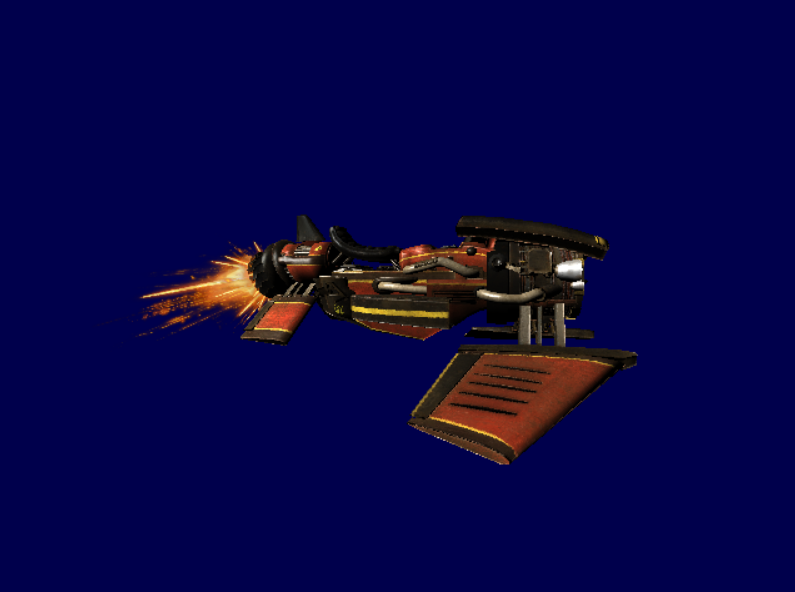

# Rasterizer
This project was the exam for a module called Graphics Programming.
It contains both a DirectX Rasterizer and a custom written Rasterizer. To switch between the 2, press R.

The scene is a vehicle and its exhaust.

# How to use

* R: Swap between DirectX and Software Rasterizer
* F: Switch between Texture sampling states (DirectX only)
* T: Toggle transparancy (DirectX only)
* C: Switch between cull modes
* Move: WASD
* Go up: E
* Go down: Q
* increase FOV: Left-Arrow
* decrease FOV: Right-Arrow
